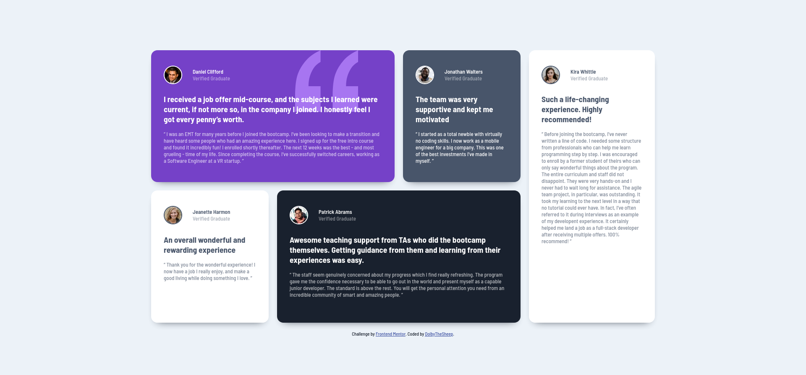
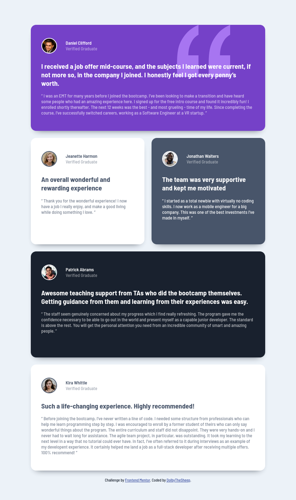

# Frontend Mentor - Testimonials grid section solution

This is a solution to the [Testimonials grid section challenge on Frontend Mentor](https://www.frontendmentor.io/challenges/testimonials-grid-section-Nnw6J7Un7). Frontend Mentor challenges help you improve your coding skills by building realistic projects. 

## Table of contents

- [Overview](#overview)
  - [The challenge](#the-challenge)
  - [Screenshot](#screenshot)
  - [Links](#links)
- [My process](#my-process)
  - [Built with](#built-with)
  - [What I learned](#what-i-learned)

## Overview

### The challenge

Users should be able to:

- View the optimal layout for the site depending on their device's screen size

### Screenshot

| Desktop                            |  Tablet                          |   Mobile                         |
|------------------------------------|----------------------------------|----------------------------------|
||||

### Links

- Solution URL: [https://github.com/DolbyTheSheep/Testimonials-Grid-Section.git](https://github.com/DolbyTheSheep/Testimonials-Grid-Section.git)
- Live Site URL: [https://dolbythesheep.github.io/Testimonials-Grid-Section/](https://dolbythesheep.github.io/Testimonials-Grid-Section/)

## My process

### Built with

- Semantic HTML5 markup
- CSS custom properties
- Flexbox
- CSS Grid
- Mobile-first workflow

### What I learned

With this challenge I learned how to use the Grid.

I used three different layouts for mobile, tablet and desktop.
I also added a box-shadow and a scale transform to all the sections.

The background image was stacked using `z-index`.